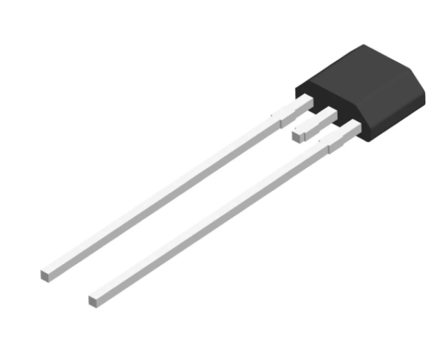
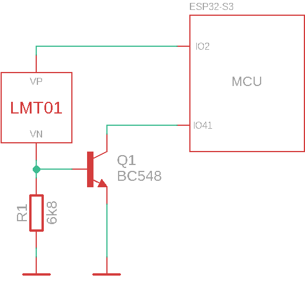
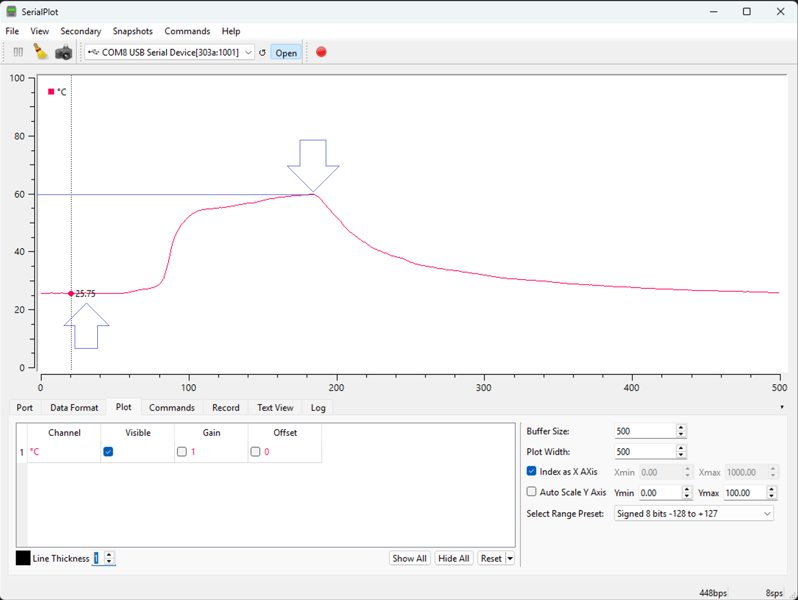
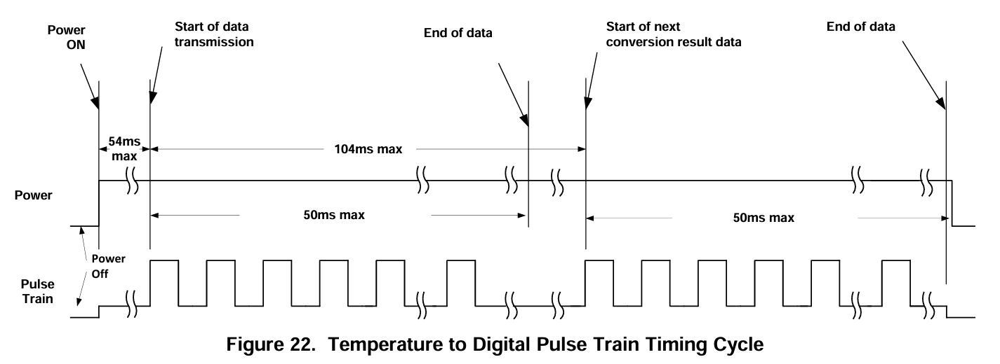

# LMT01 Temperature Sensor Library (ESP32 + Arduino)

An Arduino-compatible library for the **ESP32** platform that interfaces with the Texas Instruments **LMT01** digital temperature sensor using a **pulse-counting** method and hardware timer.

<p align="center">
  
</p>

## Key Features

- Works with ESP32 (Arduino framework)
- No analog pins required — digital pulses are counted instead
- Hardware timer-based measurement window
- Temperature output in Celsius
- Ultra-low power consumption: typically 34 µA to 125 µA during the temperature-to-digital conversion process.
- High accuracy: ±0.5 °C (–20 °C to 90 °C), ±0.625 °C (90 °C to 150 °C), ±0.7 °C (–50 °C to –20 °C)

## Basic Usage

```cpp
#include "LMT01.h"

#define LMT01_PULSES_PIN 41
#define LMT01_PWR_PIN 2

LMT01 sensor(LMT01_PULSES_PIN, LMT01_PWR_PIN, 130); // 130ms window

void setup() {
    Serial.begin(19200);
    sensor.begin();
}

void loop() {
    if (sensor.ready()) {
        float temp = sensor.read();
        Serial.printf("%.2f %cC\n", temp, 176);
    }
}
```

> Note: This library is designed specifically for ESP32 boards using the Arduino framework. It uses hw_timer_t and attachInterrupt for reliable pulse measurement.

## Basic Circuit

> Internal pull-up enabled by the library.

## Serial Output

> Temperature variation from an ambient temperature of around 25 °C up to approximately 60 °C (achieved by placing the sensor in contact with water preheated in the microwave for about 40 seconds).

# Concepts ([Datasheet](assets/LMT01.pdf))
## Time Window Definition


## Transfer Function
The output transfer function is approximately linear and can be expressed as:

$$
\text{Temp} = \left( \frac{\text{PC}}{4096} \times 256^\circ\text{C} \right) - 50^\circ\text{C}
$$

Where:
- **PC** is the number of pulses counted within the defined time window.
- **Temp** is the resulting temperature in degrees Celsius.

## Compatibility
This library was tested with:

- **ESP32 Arduino Core v3.2.0**  
  Based on **ESP-IDF v5.4.1**  
  🔗 [GitHub Release: espressif/arduino-esp32 v3.2.0](https://github.com/espressif/arduino-esp32/releases/tag/3.2.0)

> For best results, ensure you are using this version or later of the ESP32 Arduino core.
